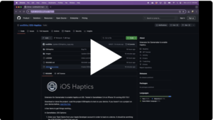

Extension for Gamemaker to enable Haptics on iOS.
Tested in GameMaker 2.4 on iPhone 13 running iOS 17.5.1

Download or clone the project. Load the project iOSHaptics to test on your device. If you haven't run a project on your device before, [read this first.](https://help.gamemaker.io/hc/en-us/articles/115001368747-Setting-Up-For-iOS-Including-iPadOS#_ga=2.83227282.525071896.1710877857-1987929704.1700668779)

A few items to get things working...

In GameMaker, iOS Options:

1. Enter your Team Name from your Apple Developer account in order to load on a device. It should be somthing like K3511FXSW2 (I made that one up). 
2. Also update the bundle name.
3. Build Setting should be set to minimum Version 13.0

Try the demo first, feel free to customize the vibrations. 
The script to trigger in located in obj_button - Left Pressed

There are several methods:

* iOS_triggerVibration(length);
* iOS_triggerDoubleVibration(first_length,pause,second_length);
* iOS_triggerPop(); (ver 1.0.1)
* iOS_triggerDoublePop() (ver 1.1.0)
* iOS_triggerStrong() (ver 1.1.0)
* iOS_triggerSwell(length, initial_intensity, final_intensity); Intensity Range: 0.0 to 1.0 (ver 1.1.0)
* iOS_triggerWave(length, initial_intensity, final_intensity); Intensity Range: 0.0 to 1.0 (ver 1.1.0)
* iOS_triggerFanfare();

Single and Double Vibrations, Wave, and Swell are all customizable, allowing for a great variety of vibrations. 
For example, iOS_triggerDoubleVibration(0.5,0.125,0.125), creates a double vibration with 
a long first vibration followed by a short pause and short vibration.

Feel free to use in your projects! You can import the extension into an exisiting project, or customize the demo.